# Rock Paper Scissors Lizard Spock!

This is a website where you can play the classic game of Rock, Paper, Scissors with 2 extra options (Lizard and Spock) and new rules added for them. The user can choose wheter to play the classic game (just rock, paper and scissors) or the scaled up version (rock, paper, scissors, lizard, spock).

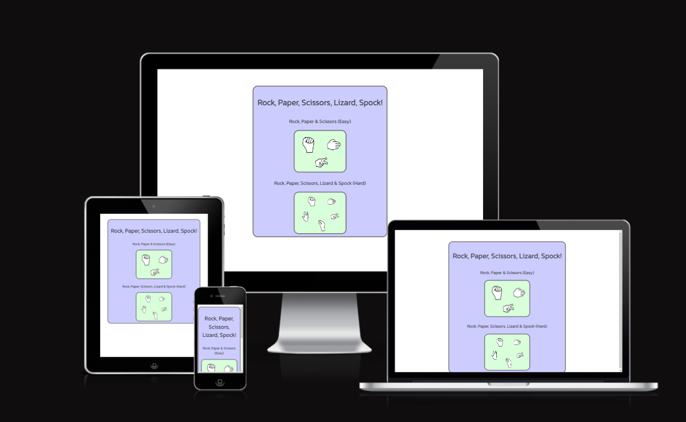

## Features

The website is structured in 3 pages:

### First page

This is the first page after opening the site. The user can see the title and will be able to choose between two difficulties by pressing on one of the images shown.

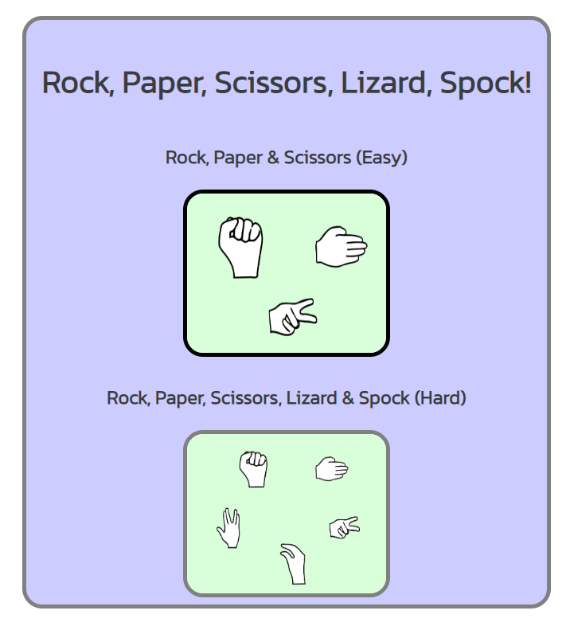

### Second page and Third page

The second page is the easy diffculty of the game and the third page is the hard difficulty.

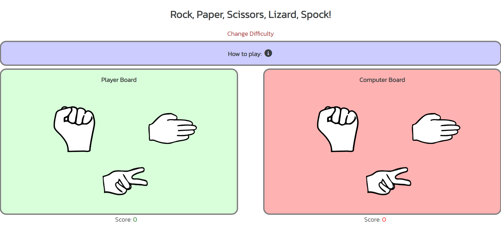
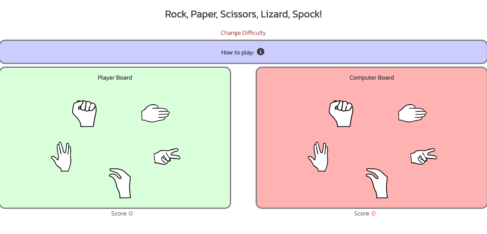

### Title and change diffculty

- This page contains the title and a button to change diffculty. 

- Both send the user to the first page.

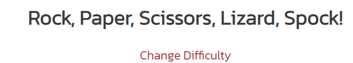

### How to play area

- How to play text and info logo.

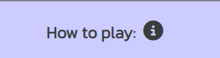

- The user need to hover over the text and logo to make a popup appear that contains the rules of the game

- The popup appears in the middle of the page after hover and dissapears when the user stops hovering.

The rules for the easy diffculty

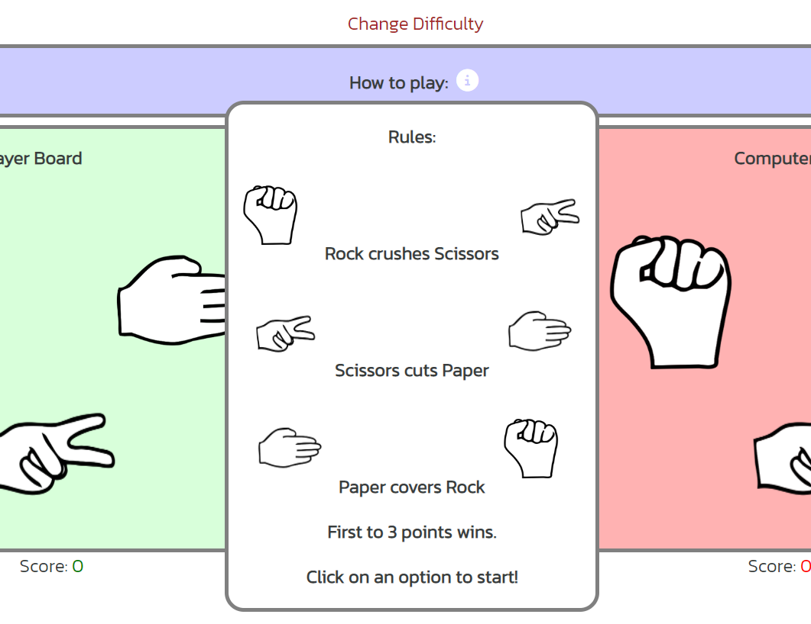

The rules for the hard diffculty

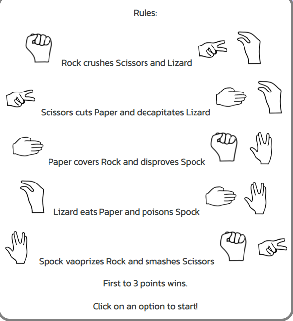

### Game area

- The game area consists in two boards, one for the user and one for the computer.

- This is where the game plays. The user will easly recognize the different the icons he has to choose to play.

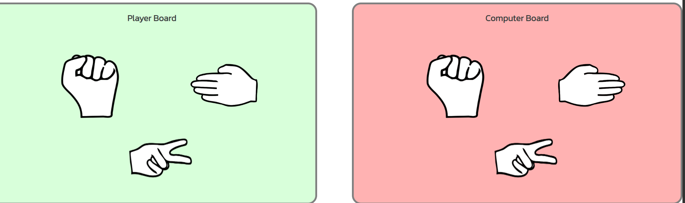

- After the user clicks on an option the other ones dissapear

- On the computer side happens the same thing but randomly

- The two boards are compared and then an alert pops up with the result of the round and the scores are incremented accordingly to the winner

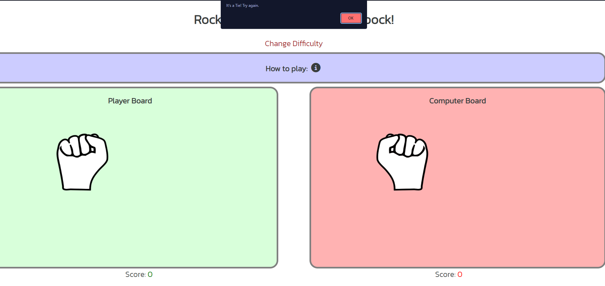

- After one of the scores reached 3 points an alert will appear that decides the game winner and the page will reload.

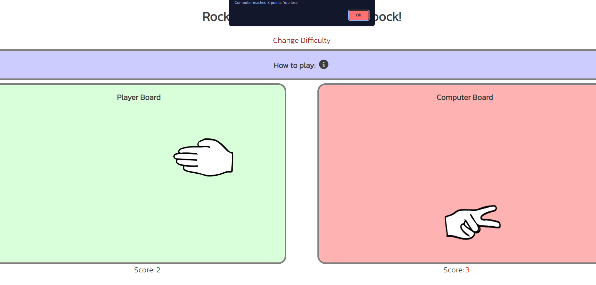

## Testing

### Validator Testing
    
    -HTML
        - No errors were returend when passing through the official.
    -CSS
        - No errors were returned when passing through the official.
    -Javascript
        - Some errors were returned when passing both js files through the official Jshint validator